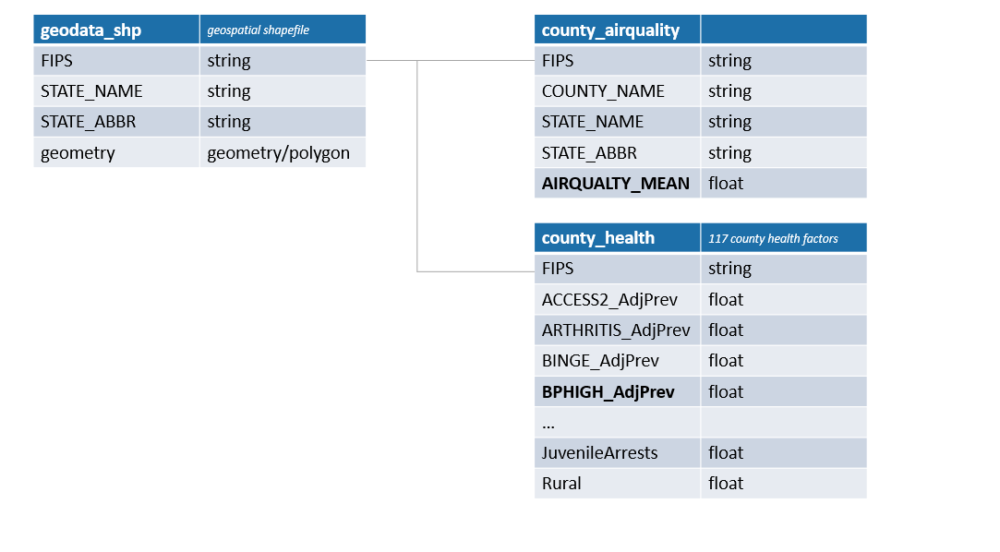
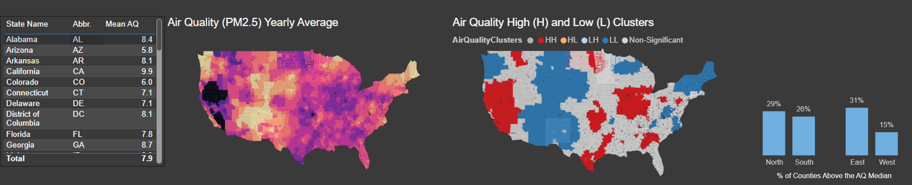
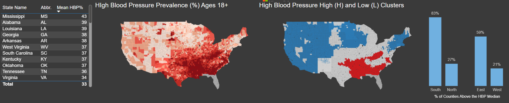
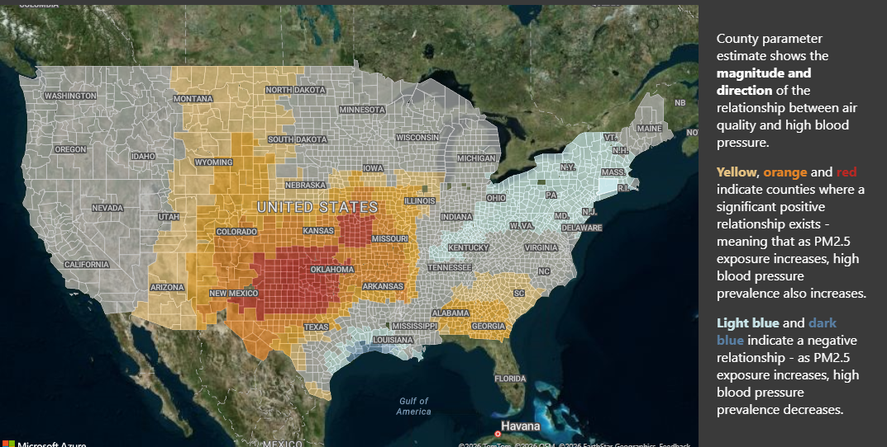

# airqualityHBP

## Project Background

TerraHealth is a mock public health organization that funds and evaluates health initiatives. In partnership with program leadership, I synthesized and analyzed national environmental and health data to assess the relationship between air quality and high blood pressure prevalence across U.S. counties and to inform data-driven allocation of public health resources.

### **Problem:**

The relationship between poor air quality and high blood pressure prevalence is not well quantified at the county level in the contiguous United States, limiting the ability to prioritize and target interventions effectively.

### **Goal:**

To develop a county-level air quality health risk assessment by identifying spatial patterns between air pollution exposure and high blood pressure prevalence and enhance outreach program impact and fund allocation by recommending key intervention locations.   

An interactive PowerBI dashboard summarizing findings can be viewed [here](https://github.com/rock-683/nitrogenMidWest/blob/main/source_and_carpentry.py).

### Literature Review:

Air pollution has become a serious threat to global health, specifically fine particulate matter (particles that are 2.5 microns or less in diameter (PM2.5)  which pose the greatest problems, because they can get deep into lungs, and sometimes into the bloodstream. 

According to WHO (2020a,b), close to 8 million premature deaths worldwide were attributable to outdoor (4.2 million) and household (3.8 million) air pollution, mainly from respiratory and cardiovascular diseases. A growing body of evidence  have shown significant correlations between fine particulate matter (PM2.5) and respiratory diseases such as coronary heart disease (ischemic heart disease), high blood pressure, stroke, and chronic obstructive pulmonary disease (COPD) (Al-Kindi et al., 2020; Manisalidis et al., 2020; Simkovich et al., 2019; Rajagopalan et al., 2018; Henning, 2024; WHO). 

Building on this literature, this project focuses specifically on examining the relationship between **air quality (PM2.5 exposure)** and **high blood pressure prevalence** across the United States and providing key areas where air pollution intervention would be most impactful on community health.

## Executive Summary

This project examined the spatial relationship between PM2.5 air quality exposure and high blood pressure prevalence across U.S. counties to inform environmental health risk prioritization. Spatial and regression analyses Results show that PM2.5 exposure and hypertension prevalence are geographically clustered, with substantial regional variation. The strongest positive associations are observed across the **Central and Southeastern United States**, while parts of the **Northeast and much of the West** exhibit inverse or non-significant relationships, underscoring the importance of regional context. Overall, counties in the **Central and Southeastern U.S.—particularly Georgia, Oklahoma, and parts of Kansas, Arkansas, and Texas—emerge as priority areas**, where poor air quality is consistently associated with increased hypertension prevalence and where targeted air quality interventions may yield the greatest public health impact.

 
 

## Data Structure Overview

TerraHealth's finailized project database structure as seen below consists of three tables: geodata_shp, county_airquality, and county_health. All can be joined using each county’s  Federal Information Processing Standard (FIPS) code.

 
 

Further details on data sources, cleaning and preparation for analysis are provided in the [SQL](geoaq.sql) and [python](data_source_and_carpentry.ipynb) code linked.

## Insights Deep Dive

### Air Quality

- Regional differences in PM2.5 concentrations/air quality are notable, with the West exhibiting more localized high-exposure hotspots and states east of the U.S. central longitude experiencing more widespread above-median exposure.
- So, while the West includes some of the highest state-level PM2.5 averages—particularly California (9.9) and Nevada (9.5)—only 15% of western counties exceed the national PM2.5 median, compared to 31% of counties east of the central longitude.
- Furthermore, several eastern states contain clusters of counties with high poor air quality averages, including Pennsylvania, Georgia, Oklahoma, Kansas, and Kentucky. In Indiana and Illinois, just east of the central longitude, over 90% of counties fall above the national air quality median. These patterns in East U.S. indicate region-wide exposure rather than isolated county or even state-level conditions,—potentially driven by shared environmental and structural factors such as manufacturing density, urban traffic, and industrial activity. In parts of the West, environmental drivers such as wildfire smoke may play a larger role.
- Statistically significant High–High (HH) and Low–Low (LL) clusters confirm strong spatial dependence in PM2.5 exposure (Moran’s I = 0.89, p = .001), reinforcing the importance of spatially informed methods when assessing environmental health risk and prioritizing interventions.

**Airquality: [Exploratory data analysis](exploratory_data_analysis/EDA_airquality.ipynb) and [Geospatial autocorrelation](gwr/SpatialAutocorrelation_airquality.ipynb) (Hot spot analysis)**
 
 

 
 

### High Blood Pressure

- Similar to air quality, a higher proportion of counties in the east (59%) had high blood pressure above the median when compared to counties in the west (just 21%). The difference is even more pronounced across the U.S. central latitude where 83% of counties south of the middle latitude line had high blood pressure prevalence above the median, compared to 27% in the North.
- These two trends taken together show a pronounced concentration of high blood pressure prevalence across the southeast, with the highest average rates in states such as Mississippi (43), Alabama (39), Louisiana (39), Georgia (38), and Arkansas (38).
- Statistically significant High–High (HH) clusters of high blood pressure prevalence align with areas of elevated PM2.5 clustering, reinforcing the plausibility of an environmental contribution to cardiovascular risk. In contrast, large Low–Low (LL) clusters dominate much of the West, where both air quality exposure and hypertension prevalence tend to be lower or more localized (Moran’s *I* = 0.89; *p* = .001).

**High Blood Pressure: [Exploratory data analysis](exploratory_data_analysis/EDA_highbloodpressure.ipynb) and [Geospatial autocorrelation](gwr/SpatialAutocorrelation_hbp.ipynb) (Hot spot analysis)**
 
 

 
 

### Link between air quality and high blood pressure

- The spatial overlap between PM2.5 exposure and high blood pressure prevalence supports targeting air quality as part of environmental health risk mitigation, particularly when prioritizing regions for hypertension intervention.
- Geographically weighted regression (GWR) results support a localized association between PM2.5 exposure and high blood pressure prevalence, even after accounting for key health and community factors, indicating that the relationship varies by region.

  **Explore feature selection and spatial model analysis [here](gwrLinkTree.ipynb).**

- A positive association between PM2.5 concentrations and high blood pressure prevalence is observed across the central United States, particularly the Great Plains (e.g. Montana, North Dakota) and central Midwest (Missouri, Kansas), and extends into parts of the Southeast, including Georgia and neighboring states. In these regions, higher PM2.5 concentrations are associated with increased high blood pressure prevalence.

- In contrast, parts of the Northeast, including Pennsylvania, Maryland, New Jersey, New York, and Massachusetts, exhibit an inverse relationship, while parts of the U.S. West (including California, Nevada, and Oregon) show no significant association. In these regions, higher PM2.5 concentrations are not associated with increased high blood pressure prevalence. This heterogeneity underscores the importance of regional context when interpreting environmental health relationships.
- When focusing specifically on counties with significant positive association, high PM2.5 concentrations, and elevated high blood pressure prevalence, key priority areas emerge in the Central and Southeastern United States, particularly in Georgia, Oklahoma, and parts of Kansas, Arkansas, and Texas, where poor air quality is consistently associated with increased hypertension risk.
- 

 

 

## Recommendations

- In the Central and Southeastern United States—particularly Georgia, Oklahoma, and parts of Kansas, Arkansas, and Texas—poor air quality is associated with higher rates of high blood pressure. These regions emerge as priority areas for air quality interventions aimed at reducing hypertension prevalence.
- The relationship between air quality and high blood pressure varies by region, reflecting spatially clustered risk rather than random distribution. This pattern suggests that shared environmental practices, infrastructure, and policy contexts likely contribute to this link.
- Given these regional patterns, TerraHealth would benefit from funding multi-level interventions 
that emphasize broad, region-wide strategies, rather than isolated local fixes.
- In the Central and Southeastern U.S., where air quality exposure is widespread, environmental and policy-level interventions—such as industrial emissions reduction and transportation-related exposure mitigation—are especially warranted.
- Complementing these efforts with community-based exposure reduction and hypertension prevention strategies, including indoor air quality improvements, air filtration in schools and workplaces, and targeted blood pressure screening, supports a comprehensive, multi-level approach to reducing cardiovascular risk.
